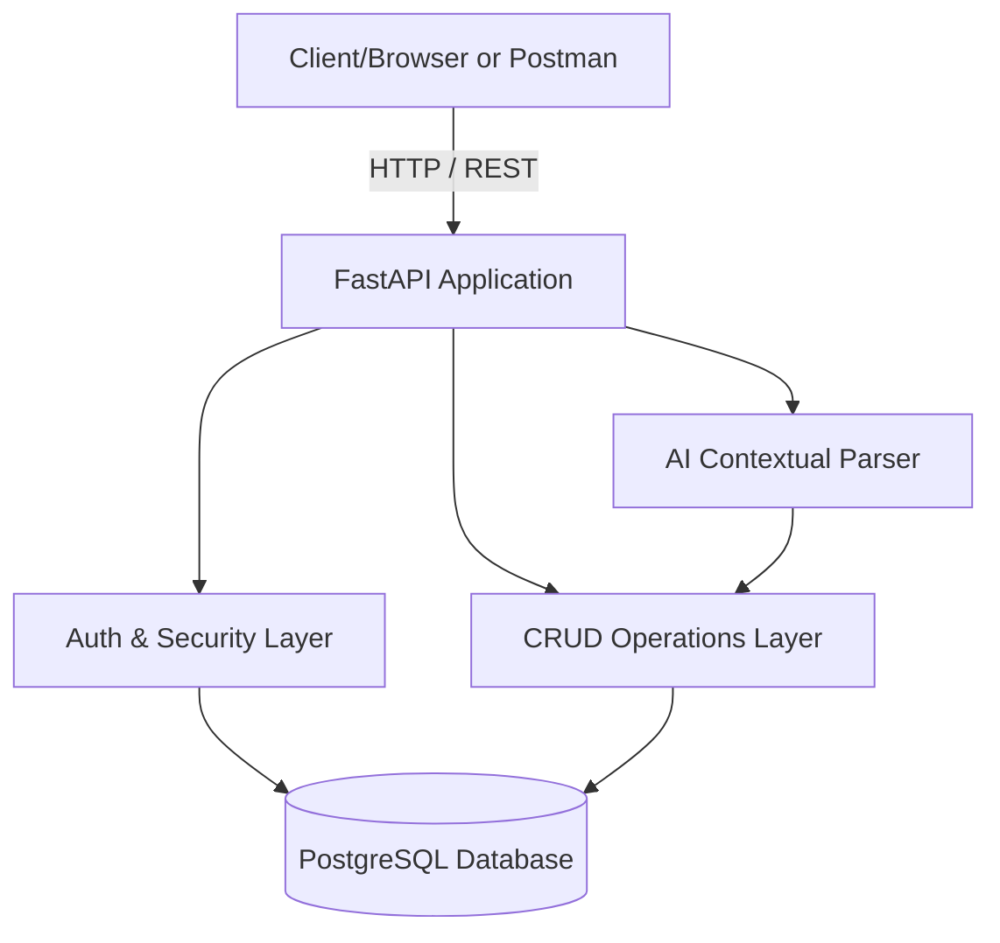

# 🎫 Ticket Management System API

A production-ready REST API built with FastAPI, SQLAlchemy, PostgreSQL, and JWT that provides a full Ticket Management platform with Authentication, Role-based Access Control (RBAC), and an experimental Rule-Based AI Natural Language Parser.

## 🚀 What the Project Does

This platform is a comprehensive ticketing system backend. 
- **Users** can register, authenticate securely (hashed passwords), and manage their own tickets. They can update priority, classification, status, and track ticket resolutions.
- **Admins** have unrestricted access to read and pull analytical aggregates representing all tickets across the system.
- **AI Assistant**: Provides a unique rule-based NLP endpoint (`/api/v1/ai/query`) allowing humans to retrieve complex application states using plain English.

---

## 🏗️ Architecture Diagram


---

## 🛠️ Tech Stack & Architecture
- **Framework:** Python 3.10+ & FastAPI
- **Database:** PostgreSQL (with SQLAlchemy ORM + Psycopg2)
- **Migrations:** Alembic
- **Pydantic V2:** Schema validation and environment control (`pydantic-settings`)
- **Security:** JWT (python-jose) & bcrypt password hashing
- **Testing:** Pytest (via SQLite for volatile isolated contexts)
- **Containerization:** Docker & Docker Compose

Our structure follows **Clean Architecture**:
- `app/api/`: Routing endpoints and Dependency Injection (Auth scopes).
- `app/crud/`: Segregated module for database interaction isolating standard business logic.
- `app/models/`: Direct SQLAlchemy Database definitions.
- `app/schemas/`: Pydantic serializations determining data contracts.
- `app/services/`: Elaborate logic services (e.g., AI NLP processing).

---

## ⚙️ Changes Required Before Setup

Before attempting to start the project, you need to inform the environment of your desired credentials.
The application actively searches for a `.env` file!

1. Rename the `.env.example` file to `.env` if you haven't already.
2. Open the `.env` file and **fill/change the variables** according to your actual setup.
   - Ensure the `POSTGRES_PASSWORD` matches the password you used when spinning up your pgAdmin or Docker image.
   - Adjust the `SECRET_KEY` with a strong cryptographic string for JWT signatures.

---

## 💻 How to Setup (Local Native Run)

Ensure you have a PostgreSQL server running locally (e.g., pgAdmin) with a dedicated database named `ticket_system` (or whatever you set `POSTGRES_DB` to in `.env`).

1. **Activate Virtual Environment**
   ```powershell
   python -m venv venv
   .\venv\Scripts\Activate.ps1
   ```

2. **Install Requirements**
   ```bash
   pip install -r requirements.txt
   ```

3. **Run Database Migrations**
   This dynamically creates your tables.
   ```bash
   alembic upgrade head
   ```

4. **Start the FastAPI Server**
   ```bash
   uvicorn app.main:app --reload
   ```

5. **Engage APIs**
   Open your browser to: [http://127.0.0.1:8000/docs](http://127.0.0.1:8000/docs)

---

## 🐳 How to Setup (Docker Run)

If you don't want to install Python or set up a local Postgres database, you can deploy the complete stack using Docker!

1. **Verify Docker Desktop** is running on your machine.
2. Build and compose the architecture:
   ```bash
   docker-compose up --build -d
   ```
   *Note:* The container automatically handles the `alembic` migrations and boots up Postgres instantly.
   
3. **Engage APIs**
   Open your browser to: [http://127.0.0.1:8000/docs](http://127.0.0.1:8000/docs)

---

## 📡 Sample API Requests

### 1. Authenticate (Login)
```bash
curl -X POST "http://127.0.0.1:8000/api/v1/auth/login" \
     -H "Content-Type: application/x-www-form-urlencoded" \
     -d "username=admin@example.com&password=yourpassword"
```

### 2. Create a Ticket (Requires Auth Token)
```bash
curl -X POST "http://127.0.0.1:8000/api/v1/tickets/" \
     -H "Authorization: Bearer <YOUR_ACCESS_TOKEN>" \
     -H "Content-Type: application/json" \
     -d '{"title": "Server Bug", "description": "Server crashes on startup.", "priority": "high", "category": "engineering"}'
```

### 3. List All Own Tickets (With Pagination/Filters)
```bash
curl -X GET "http://127.0.0.1:8000/api/v1/tickets/?priority=high&status=open&skip=0&limit=10" \
     -H "Authorization: Bearer <YOUR_ACCESS_TOKEN>"
```

---

## 🤖 AI Assistant Example

The system includes a robust AI query parser endpoint (`POST /api/v1/ai/query`) that natively understands human terminology and interprets natural language queries and maps them to structured database operations.

**Request:**
```bash
curl -X POST "http://127.0.0.1:8000/api/v1/ai/query" \
     -H "Authorization: Bearer <YOUR_ACCESS_TOKEN>" \
     -H "Content-Type: application/json" \
     -d '{"query": "Show me all high priority open tickets"}'
```

**Response (JSON):**
```json
{
  "intent": "LIST_TICKETS",
  "data": {
    "filters": {
      "priority": "high",
      "status": "open"
    },
    "tickets": [
      {
        "ticket_id": 1,
        "title": "Server Bug",
        "status": "open",
        "priority": "high"
      }
    ]
  }
}
```
**Context-Aware Memory**: You can subsequently ask *"Summarize it"* or *"What is its status?"* in your next payload and the in-memory system automatically correlates the question back to `ticket_id: 1`!

---

## 🧪 Testing

The repository contains isolated integration tests that dynamically use a local SQLite instance to avoid overriding or damaging data in your live PostgreSQL instance.

Ensure your virtual environment is activated and execute:
```bash
pytest
```
This will evaluate Authentication pathways, DB integrity, and complex CRUD workflows to ensure the system responds properly.
